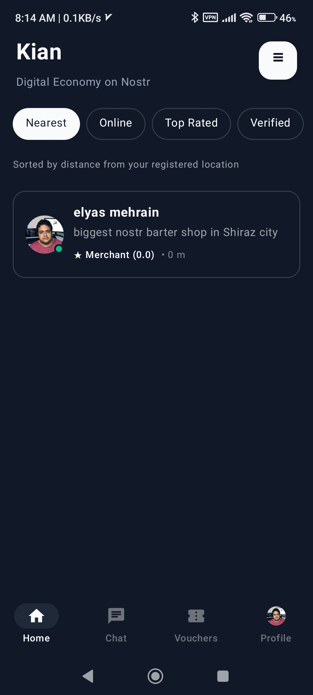
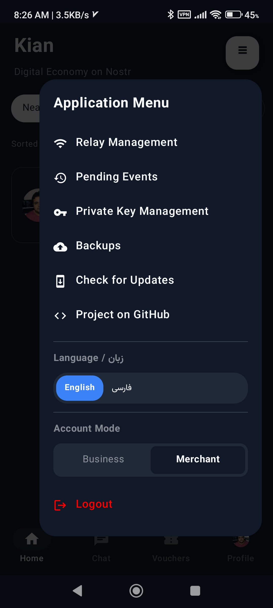
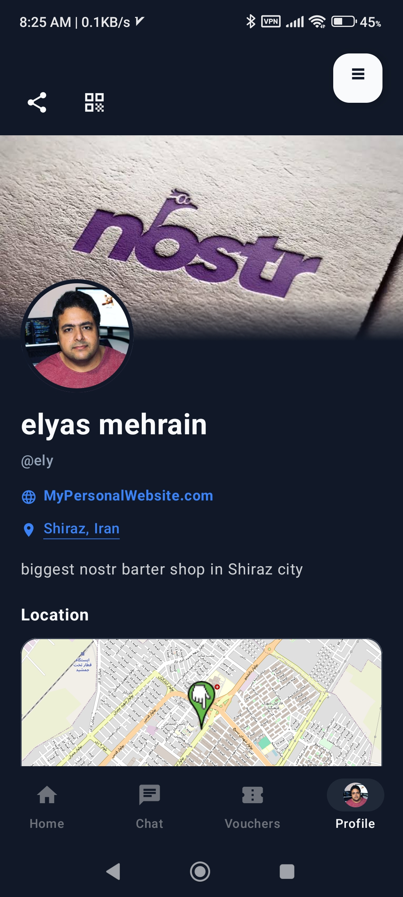

# Kian - Local Barter Market on Nostr

[](https://kotlinlang.org)
[](https://developer.android.com)
[]()

[🇮🇷 فارسی (Persian)](README-fa.md) | [🇺🇸 English](README.md)

Kian is an open-source Android application for creating and managing local barter markets. The goal of Kian is to enable businesses, producers, service providers, and merchants in a region to conduct part of their transactions without complete dependence on fiat money, through transferable vouchers, local credit, and product pools.

Kian is not meant to completely replace money, banks, the law, or the formal economy. This project is an auxiliary tool for local communities so that when cash is scarce, sales have slowed down, production capacity is idle, or businesses can supply each other's needs with goods and services, they have the possibility of simpler and more transparent exchange.

## Screenshots

| Home | Menu |
|------|------|
|  |  |

| Profile | Profile Details |
|---------|-----------------|
|  |  |

| Vouchers |
|-----------|
|  |

## Table of Contents
- [Core Idea](#core-idea)
- [How Does Kian Work?](#how-does-kian-work)
- [Key Features](#key-features)
- [Tech Stack](#tech-stack)
- [Technical Architecture & Infrastructure](#technical-architecture--infrastructure)
- [Getting Started](#getting-started)
- [Who Can Use Kian?](#who-can-use-kian)
- [Limitations & Realism](#limitations--realism)
- [Contributing](#contributing)

---

## Core Idea

In many local markets, the main problem is not the lack of goods or skills, but the lack of liquidity, poor coordination, and insufficient trust among economic actors.

For example:
- **A farmer** has produce but not enough cash to buy tools.
- **A repairman** offers services but his customers cannot pay in cash immediately.
- **A seller** has various goods but some customers can offer products or services instead of money.
- **A producer** has idle capacity but cannot quickly connect it to real demand.

Kian attempts to connect these scattered capacities into a local market.

### What is the Unit of Account?
In Kian, there are no abstract, unbacked coins or tokens. The basis of valuation is goods and services. A **Voucher** is a physical or service commitment given by a producer (like a check or warehouse receipt). This token specifies that its holder can receive a specific good with specified quality (e.g., "one pair of Model X shoes") from the issuer in the future.

---

## How Does Kian Work?

In Kian, any business can introduce its good or service and issue a transferable voucher or credit in return. This voucher shows that the issuer is committed to providing a specific amount of goods or services in the future.

### The Role of Merchants and Product Pools
Exchange in Kian is not just between two people. An important part of the system is the role of merchants.
Merchants in Kian act as market managers or operators of **product pools**. They receive vouchers, goods, or services from various businesses and, in return, supply the diverse needs of market actors.

For example:
1. **Shoemaker** issues a shoe voucher.
2. **Merchant** accepts this voucher and gives the shoemaker raw materials or needed goods in return.
3. Merchant puts the shoe voucher in his showcase.
4. Another person who needs shoes can receive that voucher from the merchant.
5. Finally, the voucher holder can spend it at the shoemaker and receive actual shoes.

In this model, the merchant does not act as a destructive middleman or mere broker; rather, his role is aggregating goods, managing risk, creating variety in the market, and increasing the liquidity of vouchers.

### Product Pools can include:
- Local food and agricultural products
- Clothing, technical services, and repairs
- Tools and raw materials
- Transportation services and local producers' vouchers
- Even fiat money, gold, or cryptocurrency (as exchangeable goods)

### Merchant's Responsibility for Vouchers (Store Model)
Kian is built on the principle that "credit is the engine of trade." Merchants act as guarantors of liquidity:
- **Refund:** If a voucher is not honored by the producer, you can return it to the merchant and receive an equivalent value.
- **Transparency:** Negative ratings and reviews ruin the reputation of defaulting merchants.
- **Whistleblowing:** Other merchants cut ties with individuals who have a low rating.

### Transferable Vouchers
Vouchers can change hands among different people. To prevent fraud, voucher transfers are done with cryptographic signatures and local recording of their spent status. The voucher issuer manages the ledger related to their own vouchers.

---

## Key Features

- **Android App** with a simple user interface
- **Offline-First Architecture**
- Uses **Nostr Protocol** for decentralized communication
- **Identity based on cryptographic keys**
- **Transferable Vouchers** with local state tracking
- Ability to work with multiple Nostr relays
- **Encrypted Chat** for coordinating transactions
- **Local Rating and Trust Validation**

---

## Tech Stack

- **Programming Language:** Kotlin 1.9+
- **UI:** Jetpack Compose with KianTheme based on Material 3
- **Database:** Room Database
- **Networking:** WebSockets (async sync with Coroutine/Flow) using Nostr protocol relays
- **Cryptography:** Secp256k1 (authentication), NIP-44 (secure chat), and BIP39 (recovery phrases)

---

## Technical Architecture & Infrastructure

### 1. Solving Double-Spending with Producer-Led Ledger
To prevent double-spending without needing a blockchain, Kian uses a multi-hop transferable UTXO model:
- Vouchers are `Kind 35001` Nostr events, whose status is stored in the `token_utxos` database.
- To transfer to another person, a transfer request (`Kind 1050`) is sent to the original issuer.
- The `VoucherNostrHandler` class on the issuer's phone checks the UTXO status, invalidates it (`voucherDao.markSpent`), and signs a new reminted voucher (`Remint - Kind 35002`) for the new recipient.

### 2. Sybil Resistance in Web of Trust (Default Risk)
Kian's rating engine only calculates the scores of people you follow directly or indirectly (Web of Trust - `Kind 3`). With the filtered query `WHERE pubkey IN (:authorPubkeys)`, fake scammer accounts will have no credibility.

### 3. Resilience Against Internet Outages and Censorship
- **Offline Queue:** During internet outages, transactions are compressed in CBOR format and stored in the `offline_queue` table to be sent later (even via SMS or radio).
- **Commercial Darkroom (NIP-59 / NIP-44):** Voucher transfers are published as encrypted Gift Wraps.

---

## Getting Started

To develop or run the code for this project, you need the following tools:
- Android Studio Ladybug (or newer)
- JDK 17
- Internet connection to download Gradle packages
- Bash

### Installation Steps
```bash
# Clone the repository
git clone https://github.com/elyasmehraein/kian.git

# Navigate to the project directory
cd kian

# Build the debug APK or run on connected emulator/device
./gradlew assembleDebug
```

---

## Who Can Use Kian?
- Local producers, shops, and stores
- Farmers and livestock breeders
- Service providers and repairmen
- Cooperatives and local markets
- Merchants and suppliers who can manage multiple types of goods or services

### What Problems Does Kian Solve?
- Helping small businesses sell during liquidity shortages
- Reducing complete reliance on cash payments in small and medium transactions
- Helping form local trust networks
- Increasing the resilience of local markets during recessions, inflation, or disruptions in formal payments

---

## Limitations & Realism

Kian alone does not create trust, production, commitment, or economic justice. This software only provides the tool for coordinating, recording, and transferring local credit.

For a Kian market to succeed, these factors are essential:
- Real businesses offering goods and services
- Trustworthy merchants to manage product pools
- Clear rules for dispute resolution
- Social acceptance within a local area
- Transparency in the valuation of goods and vouchers

---

## Contributing

Kian is an open-source project and welcomes contributions from developers, economists, and decentralized economy enthusiasts.
You can contribute to this infrastructure by opening an **Issue** to report bugs, suggest new features, or by submitting a **Pull Request**.

---
*Kian means local barter market; a market for turning scattered capacities into real exchanges.*